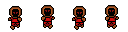
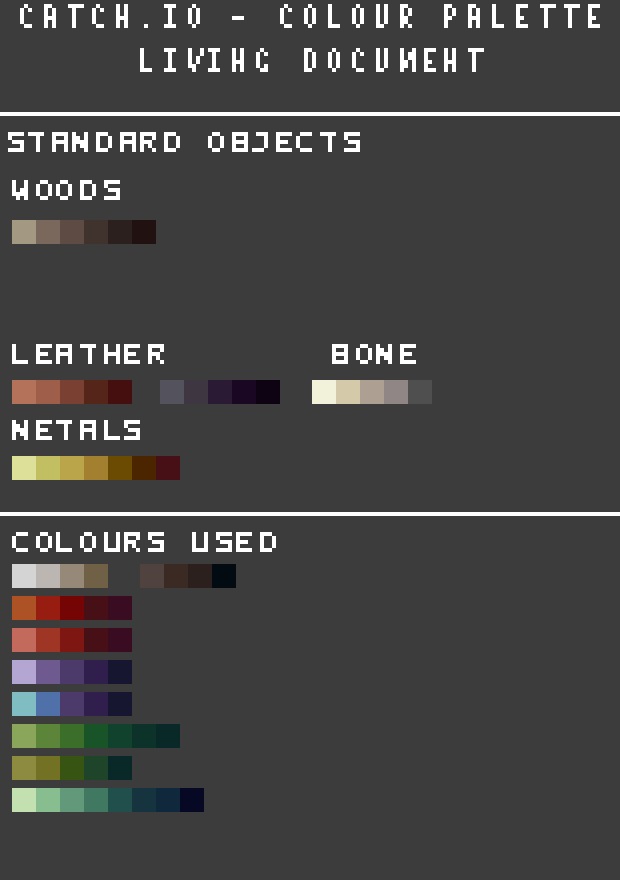

# Art Asset Structure

This section will describe how art assets for Catch.io should be structured.

## Directory

Every art assets used in the game (excluding UI) is stored in `Assets/Textures/`.
This includes character sprites, environmental objects, throwable objects and map tile sets.
Everything relating to the UI such as menu, title, inventory icon, etc will be stored in `Assets/UI/`.

## Asset import settings

When importing the assets to Unity engine, the file settings should be like the following:

Texture Type: `Sprite (2D and UI)`
Sprite Mode: `Multiple` or `Single`
Pixels Per Unit: `32`
Filter Mode: `Point (no filter)`
Compression: `None`

When slicing animated sprites, it is recommended to use the `Grid by Cell Count` method.

## Submitting Assets

For artists who are submitting their work, it is recommended to upload the work to Google Drive `Team STEP/Projects/Project Catch.io/Sprites/` folder with the appropriate name of the sprite that is being added.
Because Google Drive does not send responsive notifications for uploading images, the artist will have to notify the developer that their work has been uploaded via Slack.

### Folder Structure

Animated character sprites will be placed in the `Characters/` folder with the name of the character as the root directory.
Inside this folder, there should be a subdirectory that describes the action (ex: `Characters/Shade/Walking/`, `Characters/Shade/Running/`, `Characters/Shade/Crouching/`, etc.).
The actual image file will be saved within those folders.

Completely optional, but it is recommended to create source folder as well that stores the original work file in any format as a backup solution (ex: `Characters/Shade/source/running.aseprite`).

### Image Format

It is recommend that the final asset is saved as `.png`, but Unity supports a vast number of image formats, so as long as the file can save alpha channel data or layer data (if required), the artist can save it as any format as they want.

For any animated sprites, it is recommend to separate the sprite asset into animation sheets like the following sample image.

Character sprites should be separated into each directions where a single image contains all the frames for that direction.
The asset file name should be prefixed with the action and suffixed with the direction that the character is facing with a space in between the two.
The direction should be named as the cardinal direction (ex: `Run NE.png`, `Walk S.png`, etc.).

To summarize all of this, character assets should have the format of `Characters/{Character Name}/{Action}/{Action Direction}.png`.
Theses are some of the examples:

- `Characters/Shade/Walking/Walking NW.png`
- `Characters/Shade/Running/Running N.png`
- `Characters/Shade/Throwing/Throwing SW.png`
- `Throwables/Torch/Torch1.png`
- `Throwables/Frog/Red Frog/Back.png`

## Asset Color Palette

Both characters and props must follow the following color palette to keep a consistent feeling for the visual assets.

A single component of an asset (such as metal, gold, cloth, etc.) should be within 2 variations of light to dark palettes/color.
Feel free to add more but the main idea is that for artists to make an object e.g a wooden barrel it should use the same wood colors as the trees in the environment.
