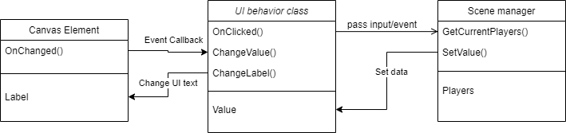

# Project Structure

This chapter will discuss about the file structure of this project and how the project should be organized.
Because of how game development works, this chapter will change depending on what type of assets we add to the game.
In such situation, please update this doc to the corresponding changes so no one is confused to where things are stored.

## Core Folder Types

This project will have the following core folder types:

- Audio - contains every assets that is in a audio format like background music, in-game sound effects, UI sound effects, background sound, etc.
- Editor - C# scripts that are specifically made for the Unity Editor to support development. Game-affecting logic does not belong in this folder.
- Gizmos - Similar to the `Editor` folder, this folder will contain all visual assets that are used for the editor, like inspector icons or other visual indicators.
- Materials - Contains all material assets (in the format of `.mat`) that are used in the game.
- Plugins - Third-party libraries from the Unity Asset Store or helper scripts that does not change frequently and is compatible with other Unity projects should be stored in this folder.
- Resources - contains all game object resources like object prefabs, rule tiles, scritable objects, etc.
- Scenes - games scene will be in this folder
- Scripts - every script that is directly made for the project belongs in this folder.
- Shaders - shader files will be in this folder.
- Textures - every 2D image files will be in this folder. This include tile map, character sprite, UI elements, etc.
- TilePalettes - tile map palettes are stored in the folder

## Structuring Code

### General Structure

It is recommended that all scripts are Duck-typed (use logical naming and inheritance for all scripts that requires future expandability) and use inheritance to neatly wrap the function of each component.
This means that scripts with similar functionality should be wrapped with a parent class that inherits from `MonoBehaviour` (or another class that inherits from it like `MonoBehaviourPun`).
The same logic will apply to folder structuring as well.

### Interacting with the UI

In Unity, scene elements and the code are kept separate, as they only communicate through an event callback.
So scenes that requires user interaction through UI elements must have a scene manager or a UI handler object of sort.
To increase code scalability, the HUD or menu UI objects should be kept separated from the backend logic that handles the data for UI to display.
Instead, allow the UI controller script to interact with the scene objects and relay the user input into a handler script.
This can resemble a simplified version of the MVC pattern.

In this model, the UI behavior script and the scene manager script should be in the same game object so that the manager script can access the UI behavior script via `.GetComponent<T>();`.

### Folder Structure

Because the project source code is expected to grow and change with every new feature added to the game, it won't be practical trying to limit the number of code sub-folders in the game.
Instead, this section will define the *categories* of the source code that we expect to be bundled in a folder.
A single category can be split into multiple folders, or sub-folders when needed.
It is good to keep the actual name of the folder should be descriptive enough for people to understand, but this document will not try to come up with any as we want the developers to change the name or add more when they have to.
*Folders should be kept flexible and descriptive.*

Furthermore, developers should keep all components and data types on a separate script and try to group all similar codes into a folder.
If a component behavior script becomes hard to categorize into a single folder even though they share similar characteristics, let it inherent from a parent class that implements those behaviors and place the child script into their own folders that best describes them.

Because all game-related `.cs` files are expected to be stored inside the `Assets/Scripts/` folder, the code category listed below will describe the general folder structure inside the `Scripts/` folder and no where else.
This means the following definitions will not be applicable to codes inside `Editor/` or `Plugins/` folder.

- Core classes - The core types and components that are used to build other game components. Everything in this category are not expected to be used directly in the game. Instead, they should be the template for creating new components. This will also include custom types that does not inherit from anything.
- UI controller classes - Components specifically for controlling the UI or in-game HUD. Most, if not all of them should have `using UnityEngine.UI;` in one way or another.
- Interfaces/Enums/Struct - It is best to keep all the interface, enum, data structure code into a separate folder, as it allows the team to understand what interfaces are written by us and which ones are from a 3rd party library.
- Utility classes - These classes are static functions that is only used to prevent writing the same method inside a component over and over again. Scripts in this category are expected to be used throughout different components without any dependency issue.
- Map prop classes - All components that are used for environmental objects but is not directly controlled by the player should be kept in the same folder. For example, a script for opening a door.
- Sound manager classes - Sound (music and SFX) is a crucial game play aspect for Catch.io, so we can expect many separate scripts that handles this logic.
- Controllable object classes - All scripts and components that are meant to be *directly* controlled by the client (aka, the player components) should be kept in the same folder. These should not be confused with the UI controller classes, as those are independent from the player object.
- Game manager classes - Components that are meant to handle the backend processing of a scene will be organized into its own folder.
