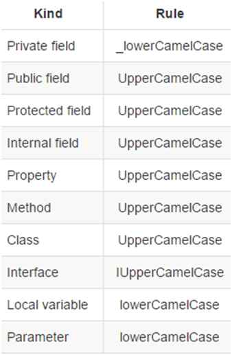

# Project Naming Schemes

This section will discuss about the naming convention of code, files, github branches, etc.
If you find any files with inconsistent naming, please fix them accordingly.

## C# Naming Conventions

Because Unity uses C# as its preferred language, the standard C# naming conventions will be used within this project.

This scheme will apply to C# script names as well.

## Unity Asset Names

Every assets used within the Unity engine will use the Upper Camel Case (ex: `MainCharacter.prefab` or `GrassLandTileSet.png`).
These assets include everything from tile maps, sprites, object prefabs, shaders, etc.

Scene names should be in Camel Case as well as well as items within the scenes too.

## Github Branch Names

As it is mentioned in the [Team STEP project manual](https://github.com/TeamSTEP/project-guidelines/blob/master/GithubGuide.md), branches will have the prefix of either `fix/`, `feature/` or `document/`.
The branch name preceding the prefix will be written in a **Kebab Case** (ex: `fix/add-player-view`).
